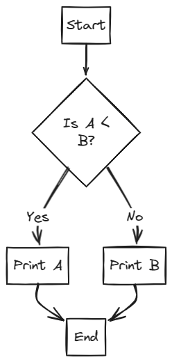

# Lecture 1 : Flowchart & Pseudocode + Installation | DSA Series by Shradha Khapra Ma'am | C++

# **DSA Series Introduction**

### **Description**

This series aims to provide an in-depth yet simple understanding of Data Structures and Algorithms (DSA) concepts. It addresses common problems found in other online resources, such as incomplete explanations and lack of practice questions. The primary objective is to deliver quality DSA content to students, focusing on practical application and interview preparation. (00:11-00:25)

### **Key Points**

- **In-depth and Simple Approach:** The series will cover DSA concepts thoroughly but in an easy-to-understand manner. (00:11-00:25)
- **Complete Explanations:** Unlike some resources that only provide pseudo code, this series aims for complete clarity and understanding of concepts. (00:33-00:45)
- **Quality Content:** The series is not sponsored and focuses solely on providing quality DSA content to students. (00:54-01:06)
- **Accurate Practice Questions:** The series will include a balanced set of practice questions, keeping placement requirements in mind. (01:15-01:27)
- **Confidence Building:** The goal is to ensure students feel confident in their DSA knowledge and problem-solving abilities. (01:35-01:49)

# **Why Study DSA?**

### **Description**

DSA is crucial for software engineering roles, as most tech companies assess candidates' problem-solving skills through DSA-related questions in interviews and coding tests. Strong DSA skills indicate a candidate's ability to solve problems efficiently and optimally, which is the primary job of a software engineer. (01:57-02:39)

### **Key Points**

- **Software Engineering Requirement:** DSA knowledge is essential for securing roles in the software engineering field. (01:57-02:10)
- **Problem-Solving Skills:** Companies evaluate candidates based on their DSA skills to determine their problem-solving abilities. (02:18-02:30)
- **Efficiency and Optimization:** High salaries in tech are justified by the ability of software engineers to solve problems efficiently and optimally. (02:38-02:52)
- **Interview Preparation:** DSA knowledge helps in tackling coding problems in tech interviews effectively. (02:50-03:02)

# **Series Content Overview**

### **Description**

The series will cover a wide range of data structures and algorithms. While the initial chart may seem complex, the course will break down each topic for better understanding. Additional data structures and algorithms, such as dynamic programming, greedy algorithms, and the two-pointer approach, will also be explored. (03:00-03:49)

### **Key Points**

- **Comprehensive Coverage:** The series will cover a broad range of data structures. (03:00-03:12)
- **Additional Algorithms:** Topics like dynamic programming and greedy algorithms will be included. (03:35-03:49)
- **Gradual Progression:** The course will start with basic concepts and gradually move towards advanced problems. (03:47-04:00)
- **Strong Fundamentals:** Building strong fundamental knowledge is crucial for understanding advanced topics. (04:00-04:12)

# **Prerequisites and Note-Taking Strategy**

### **Description**

Before diving into DSA, students should have a solid grasp of a programming language, preferably C++. The initial lectures will focus on strengthening C++ skills. For the first few chapters, including topics like flowcharts, pseudo code, variables, data types, operators, conditional statements, loops, and functions, detailed notes are not necessary. Instead, focus on practicing the concepts. Formal note-taking should begin with more advanced topics like binary number systems, pointers, and arrays, as these concepts will be revisited and reinforced through practice. (04:11-05:30)

### **Key Points**

- **Programming Language Proficiency:** A good understanding of a programming language (C++) is required before starting DSA. (04:11-04:24)
- **Initial C++ Focus:** The series will begin with lectures to strengthen C++ programming skills. (04:22-04:36)
- **Practice Over Note-Taking:** For the initial chapters, focus on practicing concepts rather than creating detailed notes. (04:44-04:58)
- **Later Note-Taking:** Start taking detailed notes from topics like binary number systems and pointers. (05:07-05:19)
- **Reinforcement Through Practice:** Early concepts will be reinforced through repeated practice in later lectures. (05:17-05:30)

# **Problem-Solving Process**

### **Description**

The general process for solving problems involves understanding the problem, analyzing the given inputs, finding a solution, and converting that solution into code. The focus will initially be on developing solutions on paper before translating them into code. This involves using flowcharts and pseudo code to outline the logic. (06:11-08:17)

### **Key Points**

- **Understanding the Problem:** The first step is to fully understand what the problem is asking. (06:45-06:58)
- **Analyzing Inputs:** Identify the given values or inputs required to solve the problem. (06:56-07:09)
- **Finding a Solution:** Develop a logical solution to the problem. (07:18-07:33)
- **Converting to Code:** Translate the solution into a programming language (to be covered later). (07:41-07:55)
- **Paper-Pen Solution:** Focus on creating a solution on paper before coding. (08:05-08:17)

# **Flowcharts and Pseudo Code**

### **Description**

Flowcharts are diagrams that visually represent the solution to a problem, while pseudo code is a general logic of a solution written in an English-like language. Flowcharts and pseudo code are used to develop a solution on paper before coding. (08:17-08:30)

### **Key Points**

- **Flowcharts:** Diagrams representing the solution to a problem. (09:34-09:47)
- **Pseudo Code:** General logic of a solution written in an English-like language. (14:52-15:05)
- **Logic Building:** Both tools are used for logic building and problem-solving. (09:12-09:25)
- **Optional for Experienced Programmers:** Those familiar with conditional statements, loops, and functions may skip this lecture. (08:40-08:53)
- **Not Typically Used in Interviews:** Flowcharts are primarily for logic building and are not commonly used in interviews. (09:12-09:25)

# **Flowchart Components**

### **Description**

Flowcharts use specific components to represent different steps in a solution. These components include ovals for start and end points, parallelograms for input and output, rectangles for processes, diamonds for decisions, and arrows to show the flow of the solution. (11:12-14:31)

### **Key Points**

- **Oval:** Represents the start or end of a solution. (11:23-11:36)
- **Parallelogram:** Represents input or output operations. (11:46-12:10)
- **Rectangle:** Represents a process or calculation. (12:32-12:45)
- **Diamond:** Represents a decision or condition. (13:48-14:01)
- **Arrows:** Indicate the flow of the solution. (13:14-13:28)

Here is a table of the flowchart components:

| Component | Shape | Description |
| --- | --- | --- |
| Start/End | Oval | Indicates the beginning or end of the process |
| Input/Output | Parallelogram | Represents data input or output |
| Process | Rectangle | Represents a step or action in the process |
| Decision | Diamond | Indicates a decision point |
| Flow Direction | Arrow | Shows the direction of the process |

# **Pseudo Code Structure**

### **Description**

Pseudo code is written in an English-like language and is easily understandable by developers, regardless of their programming language proficiency. It outlines the general logic of a solution in a step-by-step manner. (15:02-15:37)

### **Key Points**

- **English-Like Language:** Pseudo code is written in a simple, understandable language. (15:02-15:15)
- **General Logic:** It represents the overall logic of a solution. (15:25-15:37)
- **Step-by-Step:** Pseudo code is written in a sequential, step-by-step format. (15:46-16:01)
- **No Fixed Rules:** Pseudo code does not have strict syntax rules. (16:32-16:46)

# **Example 1: Area of a Square**

### **Description**

This example demonstrates how to find the area of a square using flowcharts and pseudo code. The process involves taking the side of the square as input, calculating the area using the formula Area = a^2 , and then printing the result. (18:09-18:33)

### **Key Points**

- **Problem:** Find the area of a square. (18:09-18:22)
- **Input:** Side of the square (a). (18:31-18:45)
- **Formula:** Area = a * a (18:31-18:33)
- **Pseudo Code:**
    1. Input a
    2. Area = a * a
    3. Print Area
    4. Exit

# **Example 2: Minimum of Two Numbers**

### **Description**

This example illustrates how to find the minimum of two numbers using flowcharts and pseudo code. The process involves taking two numbers as input, comparing them, and printing the smaller number. (21:20-21:34)

### **Key Points**

- **Problem:** Find the minimum of two numbers. (21:20-21:34)
- **Input:** Two numbers, a and b. (21:31-21:45)
- **Comparison:** Check if a < b. (21:42-21:57)
- **Flowchart:**
    
    
    
- **Pseudo Code:**
    1. Input a and b
    2. If a < b
        - Print a
    3. Else
        - Print b
    4. Exit

# **Example 3: Odd or Even Number**

### **Description**

This example demonstrates how to determine if a number is odd or even using flowcharts and pseudo code. The process involves taking a number as input, checking if it is divisible by 2, and printing whether it is odd or even. (27:53-28:06)

### **Key Points**

- **Problem:** Determine if a number is odd or even. (27:53-28:06)
- **Input:** A number, n. (28:15-28:27)
- **Modulus Operator:** Use the modulus operator (%) to check if n \% 2 == 0. (29:53-30:06)
- **Flowchart:**
    
    .png)
    
- **Pseudo Code:**
    1. Input n
    2. If n % 2 == 0
        - Print Even
    3. Else
        - Print Odd
    4. Exit

# **Example 4: Sum of Numbers from 1 to n**

### **Description**

This example illustrates how to find the sum of numbers from 1 to n using flowcharts and pseudo code. The process involves taking a number n as input, initializing a sum variable to 0, and adding each number from 1 to n to the sum. (36:05-36:20)

### **Key Points**

- **Problem:** Find the sum of numbers from 1 to n. (36:05-36:20)
- **Input:** A number, n. (38:23-38:37)
- **Initialization:** Initialize sum = 0 and count = 1. (42:40-42:54)
- **Loop:** Use a loop to add each number from 1 to n to the sum. (40:02-40:16)
- **Formula (Not Used):** The direct formula n * (n + 1) / 2 is not used to focus on logic building. (36:53-37:05)
- **Flowchart:**
    
    .png)
    
- **Pseudo Code:**
    1. Input n
    2. Sum = 0
    3. Count = 1
    4. While Count <= n
        - Sum = Sum + Count
        - Count = Count + 1
    5. Print Sum
    6. Exit

# **Algorithm Logic and Dry Runs**

### **Description**

Understanding the flow of logic in algorithms is crucial. A "dry run" involves manually stepping through the code or flowchart with a specific example to analyze the solution. This helps in verifying the correctness of the logic. (47:46-47:59)

### **Key Points**

- **Dry Run:** Analyzing a solution by manually executing it with an example.
- **Condition Check:** Algorithms often involve checking conditions to determine the next step.
- **Looping:** Repeating a set of instructions until a condition is met.

# **Understanding Loops**

### **Description**

Loops are fundamental in programming for repetitive tasks. A loop continues executing a block of code as long as a specified condition remains true. In flowcharts, loops are represented by arrows that cycle back to a previous step. (48:29-48:42)

### **Key Points**

- **Loop Definition:** A sequence of instructions that repeats until a condition is no longer true.
- **Flowchart Representation:** Loops are visually depicted as cyclical paths.
- **Repetitive Tasks:** Loops are used when the same operations need to be performed multiple times.

# **Flowcharts and Pseudo Code for Sum of N Numbers**

### **Description**

Solving the problem of finding the sum of the first N numbers involves using loops. This can be represented using flowcharts and pseudo code. While flowcharts provide a visual representation, pseudo code offers a more code-like description of the algorithm. (50:00-50:14)

### **Key Points**

- **Input:** The value of `n` (the number up to which the sum is calculated).
- **Initialization:** Setting initial values for variables like `count`(starting at 1) and `sum` (starting at 0).
- **Loop Condition:** Checking if `count` is less than or equal to `n`
- **Loop Operations:**
    - Adding `count` to `sum`
    - Incrementing `count` by 1.
- **Output:** Printing the final `sum`
- **Exit:** Terminating the algorithm.

# **While Loops**

### **Description**

`While` loops are used when a condition needs to be checked repeatedly. The loop continues as long as the condition is true. In pseudo code, `while` is used to indicate that a condition is checked multiple times. (51:11-51:25)

### **Key Points**

- `While` **Keyword:** Indicates a loop that continues as long as the condition is true.
- **Condition:** The expression that is evaluated to determine whether the loop should continue.
- **Loop Body:** The set of instructions that are executed repeatedly.

# **Shorthand Operators**

### **Description**

Shorthand operators provide a concise way to modify variables. For example, `a = a + 5` can be written as `a += 5`. This notation is commonly used in coding to make the code more readable and compact. (53:15-53:28)

### **Key Points**

- `+=` **Operator:** Adds the right operand to the left operand and assigns the result to the left operand.
- **Readability:** Shorthand operators make code easier to read and understand.
- **Compactness:** They reduce the amount of code needed to perform common operations.

# **Prime Numbers**

### **Description**

Prime numbers are numbers that have only two factors: 1 and the number itself. Examples include 2, 3, 5, 7, 11, and 13. To determine if a number is prime, you can check if it is divisible by any number from 2 to n-1. (54:50-55:04)

### **Key Points**

- **Definition:** A number that is divisible only by 1 and itself.
- **Examples:** 2, 3, 5, 7, 11, 13.
- **Non-Prime (Composite) Numbers:** Numbers with more than two factors (e.g., 4, 6).

# **Algorithm to Check for Prime Numbers**

### **Description**

To check if a number n is prime, divide n by numbers from 2 to n-1. If n is divisible by any of these numbers, it is not prime. If n is not divisible by any number in this range, it is prime. (57:11-57:24)

### **Key Points**

- **Divisibility Check:** Dividing n by numbers from 2 to n-1.
- **Modulo Operator:** Using the modulo operator (%) to check for remainders.
- **Optimization:** Only check up to n-1, as numbers larger than n cannot be factors.

# **Flowchart for Prime Number Check**

### **Description**

The flowchart for checking prime numbers involves a loop that iterates from 2 to n-1. Inside the loop, it checks if n is divisible by the current number. If it is, the number is not prime. If the loop completes without finding a factor, the number is prime. (62:58-63:11)

### **Key Points**

- **Start:** Begin the process.
- **Input:** Take the number n as input.
- **Initialization:** Set i = 2.
- **Loop Condition:** Check if i ≤ n - 1.
- **Divisibility Check:** Check if n mod i = 0.
    - If Yes: Print "Non-Prime" and exit.
    - If No: Increment i and repeat the loop.
- **Prime Output:** If the loop completes without finding a factor, print "Prime".
- **Exit:** End the process.

# **Pseudo Code for Prime Number Check**

### **Description**

The pseudo code for checking prime numbers involves initializing i to 2 and using a `while`

loop to iterate from 2 to n-1. Inside the loop, it checks if n is divisible by i. If it is, the number is not prime and the algorithm exits. If the loop completes without finding a factor, the number is prime. (69:15-69:28)

### **Key Points**

- **Input:** Get the number n.
- **Initialization:** Set i = 2.
- `While` **Loop:** `while i <= n - 1` :
    - **If Condition:** `if n mod i == 0`:
        - Print "Non-Prime" and exit.
    - **Else:**
        - Increment i (i = i + 1).
- **Prime Output:** Print "Prime".
- **Exit:** End the algorithm.

# **Homework Problems**

### **Description**

Several homework problems are provided to practice flowcharts and pseudo code. These include calculating simple interest, finding the maximum of two numbers, calculating the factorial of a number, and determining if a person is eligible for a driving license based on their age. (73:44-73:58)

### **Key Points**

- **Simple Interest:** Calculate simple interest using the formula Simple Interest = P * R * T, where P is the principal, R is the rate, and T is the time.
- **Maximum of Two Numbers:** Determine the larger of two given numbers.
- **Factorial of a Number:** Calculate n! = 1 * 2 * 3 * … * n.
- **Driving License Eligibility:** Check if a person's age is greater than or equal to 18.

# **Setting Up the Development Environment**

### **Description**

To write and run code, you need to set up a development environment. This involves installing a code editor (like Visual Studio Code) and a C++ compiler. The code editor is used to write the code, and the compiler translates the code into an executable file that the computer can run. (76:11-76:24)

### **Key Points**

- **Code Editor:** A software used to write code (e.g., Visual Studio Code).
- **C++ Compiler:** A translator that converts C++ code into an executable file.
- **Executable File:** A file that the computer can run.

# **Visual Studio Code (VS Code)**

### **Description**

Visual Studio Code (VS Code) is a popular code editor that supports many programming languages, including C++. It provides features like syntax highlighting, code completion, and debugging. It is recommended for writing C++ code. (76:33-76:46)

### **Key Points**

- **Definition:** A free and powerful code editor.
- **Features:** Syntax highlighting, code completion, debugging.
- **Download:** Available for Windows, macOS, and Linux from [code.visualstudio.com/download](https://code.visualstudio.com/download).

# **C++ Compiler**

### **Description**

A C++ compiler is necessary to translate C++ code into machine-readable code. The installation process varies depending on the operating system (Windows or macOS). Specific installation videos are available for both platforms. (78:48-79:02)

### **Key Points**

- **Definition:** A translator that converts C++ code into executable files.
- **Installation:** Different processes for Windows and macOS.
- **Purpose:** To convert human-readable code into machine-readable code.

# **Troubleshooting and Long-Term Learning**

### **Description**

Encountering errors during software installation is normal. It is important to troubleshoot these errors by copying the error message and searching for solutions online. Long-term learning involves mastering the tools and processes, not just the code itself. (81:11-81:24)

### **Key Points**

- **Error Handling:** Copy error messages and search for solutions online.
- **Persistence:** Do not give up when encountering errors.
- **Long-Term Focus:** Master the tools and processes for sustained learning.